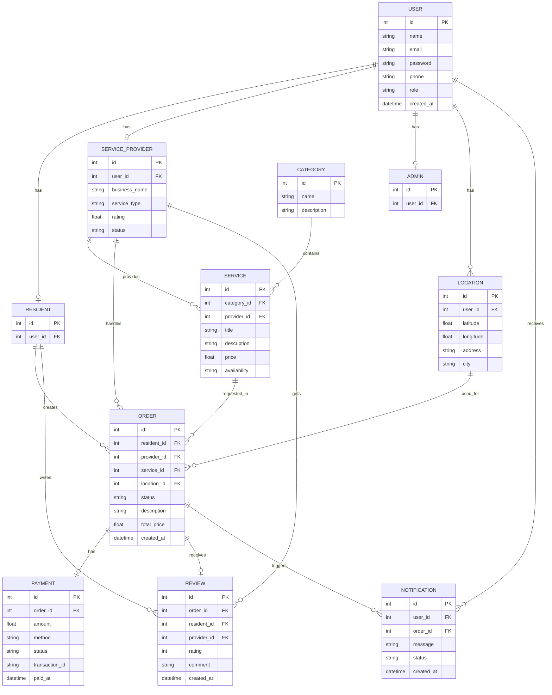

# 🏙️ Hayyek Platform – ER Diagram

## 📌 Overview
This ER Diagram represents the main database entities of the **Hayyek** platform and the relationships between them.

The system includes:

- Residents
- Service Providers
- Admins
- Services
- Categories
- Orders
- Payments
- Reviews
- Locations
- Notifications

---

## 🗂️ ER Diagram

---

## 🔗 Relationship Explanation

### User and Roles
- A **User** can be a:
  - Resident
  - Service Provider
  - Admin

Each one is stored in a separate entity linked to the main `USER` table.

### Category and Service
- One **Category** can contain many **Services**
- One **Service Provider** can provide many **Services**

### Orders
- One **Resident** can create many **Orders**
- One **Service Provider** can handle many **Orders**
- Each **Order** is linked to one **Service**
- Each **Order** uses one **Location**

### Payment
- Each **Order** has one **Payment**

### Review
- Each **Order** can have one **Review**
- A **Resident** writes the review
- A **Service Provider** receives the review

### Notifications
- A **User** can receive many **Notifications**
- Notifications may be linked to a specific **Order**

---

## ✅ Notes
This ER Diagram is suitable for:
- database design
- backend implementation
- API development
- software engineering documentation

It also matches the main features of the Hayyek platform:
- service requests
- provider matching
- payments
- ratings
- notifications
- location support
