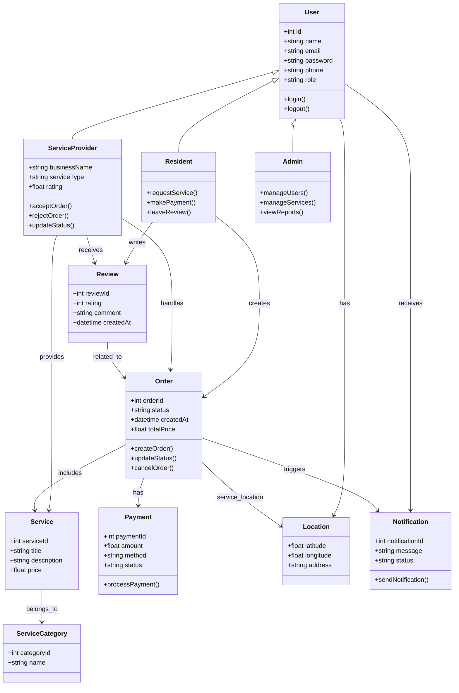

# 🏙️ Hayyek Platform – Task 2: Class Diagram

## 📌 Overview

This document represents the **Class Diagram** for the Hayyek platform.

The goal is to define:
- Main system entities (classes)
- Attributes of each class
- Relationships between classes
- System structure from an object-oriented perspective

---

# 🧱 Main Classes in the System

The system is built around the following core entities:

- User (Base Class)
- Resident
- ServiceProvider
- Admin
- Service
- ServiceCategory
- Order
- Payment
- Review
- Location
- Notification

---

# 🧬 Class Diagram

---

# 🔗 Explanation of Relationships

## 🔹 Inheritance
- `Resident`, `ServiceProvider`, and `Admin` inherit from `User`
- This ensures shared attributes like:
  - name
  - email
  - password

---

## 🔹 Service Relationships
- A **Service** belongs to a **ServiceCategory**
- A **ServiceProvider** can provide multiple services

---

## 🔹 Order Relationships
- A **Resident** creates an order
- A **ServiceProvider** handles the order
- Each **Order** is linked to a specific **Service**

---

## 🔹 Payment Relationships
- Each **Order** has one **Payment**
- Payment contains transaction details

---

## 🔹 Review Relationships
- A **Resident** writes a review
- A **ServiceProvider** receives it
- Each review is linked to an **Order**

---

## 🔹 Location Relationships
- Each **User** has a location
- Each **Order** has a service location

---

## 🔹 Notification Relationships
- Notifications are sent to users
- Orders trigger notifications

---

# 🧠 Design Considerations

- Separation of concerns between entities
- Use of inheritance to avoid duplication
- Clear mapping between real-world and system objects
- Scalable structure for future features

---

# ✅ Summary

This Class Diagram defines the core structure of the Hayyek system and ensures:

- Clear entity relationships
- Logical data modeling
- Easy transition to database design
- Strong foundation for backend implementation

---
