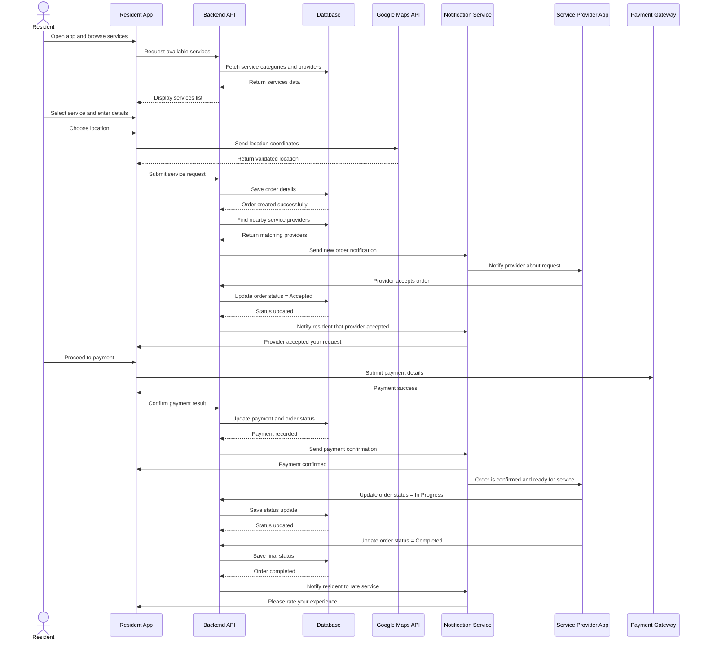

# 🏙️ Hayyek Platform – Task 3: Sequence Diagram

## 📌 Overview

This document presents the **Sequence Diagram** for the Hayyek platform.

The purpose of this task is to show how the system components interact with each other over time when a resident requests a service.

This diagram explains the flow of communication between:

- Resident
- Resident App
- Backend API
- Database
- Google Maps API
- Notification Service
- Service Provider App
- Payment Gateway

---

# 🎯 Scenario

## Main Scenario: Resident Requests a Home Service

In this scenario, the resident wants to request a service such as plumbing, electrical work, cleaning, grocery delivery, or laundry service.

The sequence below shows the full process from selecting the service until payment and confirmation.

---

# 🧭 Sequence Diagram

---

# 🧩 Sequence Explanation

## 1. Browsing Services
The resident opens the app and browses the available neighborhood services.  
The app requests the service list from the backend, and the backend retrieves the data from the database.

---

## 2. Selecting a Service
The resident selects a service and fills in the required details such as:

- service type
- description
- preferred time
- location

---

## 3. Location Validation
The app sends the selected location to **Google Maps API** in order to:

- validate the address
- retrieve coordinates
- improve provider matching

---

## 4. Creating the Order
After the resident submits the request:

- the backend stores the order in the database
- the system searches for nearby service providers

---

## 5. Provider Notification
Once matching providers are found:

- the backend triggers the notification service
- the provider receives a request on the provider app

---

## 6. Provider Accepts the Order
When the provider accepts:

- the backend updates the order status
- the resident is notified that the provider has accepted the request

---

## 7. Payment Process
The resident proceeds to payment through the payment gateway.

The payment result is returned, then:

- the backend updates payment information
- the database records the successful payment
- both resident and provider are notified

---

## 8. Service Execution
The provider starts the service and updates the order status to:

- **In Progress**
- then **Completed**

Each update is saved in the database.

---

## 9. Review Request
After the order is completed:

- the backend sends a final notification to the resident
- the resident is asked to leave a rating and review

---

# 🛠️ Main Components Used in the Sequence

## Frontend
- Resident App
- Service Provider App

## Backend
- Backend API Server
- Order Processing Logic
- Matching Logic
- Notification Logic

## Database
- Stores services
- stores orders
- stores payment records
- stores order status changes

## External Services
- Google Maps API
- Payment Gateway
- Notification Service

---

# ✅ This sequence diagram helps explain:

- how the system behaves in real time
- how different components communicate
- how the user request moves through the platform
- how external services are integrated into the flow

It also shows that the Hayyek platform supports a complete service lifecycle:

1. Service request
2. Provider matching
3. Order acceptance
4. Payment
5. Service execution
6. Completion
7. Review

---

# 📌 Conclusion

The Sequence Diagram provides a dynamic view of the Hayyek platform.  
It clearly shows the interaction between the resident, backend, provider, payment system, maps service, and notifications.

This makes the system flow easier to understand and prepares the project for implementation in the next stages.
