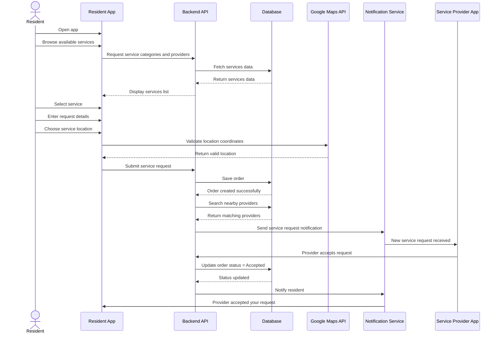
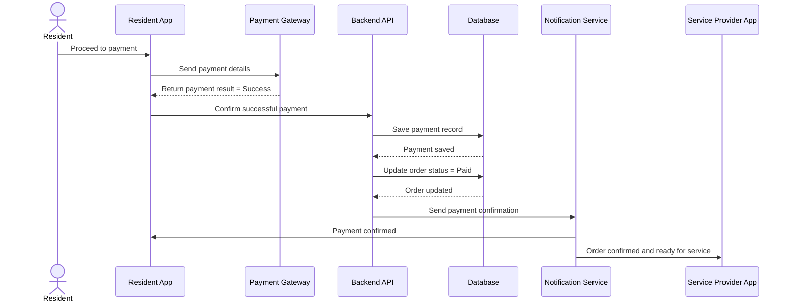
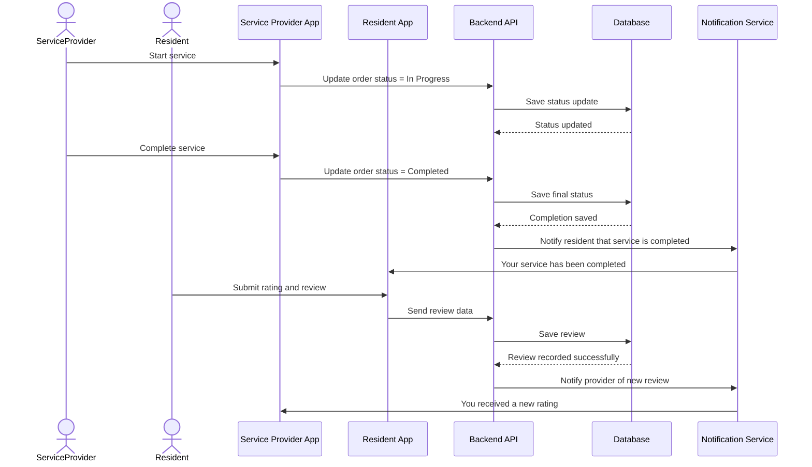

# 🏙️ Hayyek Platform – Task 3: Sequence Diagrams

## 📌 Overview

This document presents the **Sequence Diagrams** for the Hayyek platform.

Instead of using one very large sequence diagram, the system flow is divided into **three main use cases** to make the design more readable, organized, and easier to understand.

The three main cases are:

1. **Service Request Flow**
2. **Payment Flow**
3. **Service Completion and Review Flow**

This structure gives a clearer dynamic view of how the Hayyek platform works.

---

# Case 1: Service Request Flow

## 🎯 Scenario
A resident opens the application, browses available services, selects a service, chooses the location, and sends the request.  
The system stores the order, finds nearby providers, and sends the request to the provider.

## 🧭 Sequence Diagram

## 📖 Explanation
This sequence diagram explains the first and most important use case in the system:

- The resident searches for a needed service
- The system validates the selected location using Google Maps API
- The backend stores the request in the database
- Nearby service providers are searched
- A notification is sent to a provider
- The provider accepts the order
- The resident receives confirmation

This case represents the beginning of the service lifecycle.

---

# Case 2: Payment Flow

## 🎯 Scenario
After a provider accepts the request, the resident proceeds to payment.  
The app communicates with the payment gateway, and the backend updates payment and order records.

## 🧭 Sequence Diagram

## 📖 Explanation
This sequence diagram explains the payment process:

- The resident initiates payment from the app
- The app sends the payment request to the payment gateway
- Once the payment succeeds, the result is sent to the backend
- The backend stores payment data
- The order status is updated to **Paid**
- Notifications are sent to both the resident and the provider

This case highlights the integration between Hayyek and the external payment service.

---

# Case 3: Service Completion and Review Flow

## 🎯 Scenario
The provider starts the service, updates the order status during execution, and completes the task.  
Then the resident receives a notification and submits a rating and review.

## 🧭 Sequence Diagram

## 📖 Explanation
This sequence diagram explains the final stage of the order lifecycle:

- The provider starts working on the request
- The order status changes to **In Progress**
- Once the work is finished, the provider marks the service as **Completed**
- The backend updates the database
- The resident is notified that the service is finished
- The resident submits a rating and review
- The provider receives a review notification

This case completes the full service cycle in the Hayyek platform.

---

# 🧩 Main Components Involved

## Resident App
Used by residents to:
- browse services
- submit requests
- make payments
- leave reviews

## Service Provider App
Used by providers to:
- receive service requests
- accept requests
- update order status
- receive ratings

## Backend API
Responsible for:
- processing requests
- storing data
- updating order and payment statuses
- coordinating between system components

## Database
Stores:
- service requests
- user data
- provider data
- payment records
- reviews
- order statuses

## Google Maps API
Used in the request flow to:
- validate addresses
- identify service locations
- support matching with nearby providers

## Payment Gateway
Used in the payment flow to:
- process transactions
- return payment status
- support secure digital payment

## Notification Service
Used across all flows to:
- notify providers of new orders
- confirm payments
- confirm service completion
- notify users about updates

---

# 📌 Conclusion

These three sequence diagrams provide a complete dynamic view of the Hayyek platform:

1. **Service Request**
2. **Payment**
3. **Completion and Review**

Together, they explain how users, providers, backend services, database, payment systems, maps, and notifications interact throughout the full service lifecycle.

This makes Task 3 more structured, professional, and easier to evaluate.
